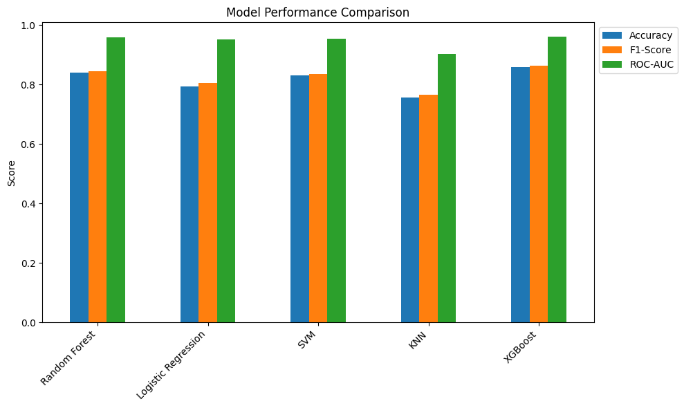

# ADHD Diagnosis Prediction Model

This repository contains a Jupyter Notebook (`adhd.ipynb`) for building, training, and evaluating machine learning models to predict ADHD diagnoses based on clinical and demographic data. The project uses data from an ADHD dataset (e.g., features like age, IQ scores, ADHD symptoms, and medication status) to classify individuals into categories: Healthy (No ADHD), ADHD, or Other Diagnosis.

The notebook performs data cleaning, model training with multiple algorithms, evaluation, and saves the best model (XGBoost) for inference. A prediction function is also provided for making new predictions.

## Table of Contents
- [Project Overview](#project-overview)
- [Dataset](#dataset)
- [Requirements](#requirements)
- [Installation](#installation)
- [Usage](#usage)
- [Model Training and Evaluation](#model-training-and-evaluation)
- [Prediction](#prediction)
- [Results](#results)
- [Contributing](#contributing)
- [License](#license)

## Project Overview
This project aims to develop a predictive model for ADHD diagnosis using supervised machine learning. Key steps include:
- Data loading and preprocessing (handling missing values, encoding, scaling).
- Balancing classes with SMOTE to address imbalance.
- Training multiple models: Random Forest, Logistic Regression, SVM, KNN, and XGBoost.
- Evaluating models using accuracy, F1-score, confusion matrices, and ROC-AUC.
- Saving the best-performing model (XGBoost) for future predictions.
- Providing a function to predict ADHD diagnosis for new data points.

The dataset appears to be derived from clinical assessments, including ADHD symptom scores (e.g., Inattentive, Hyper/Impulsive), IQ measures, and demographic info.

## Dataset
- **Source Files**:
  - `all.csv`: Raw dataset with features like ScanDir ID, Site, Gender, Age, Handedness, DX (diagnosis), ADHD Index, Inattentive, Hyper/Impulsive, IQ scores, Med Status, and quality control flags.
  - `cleaned_data.csv`: Preprocessed version used for model training (generated or assumed to exist after cleaning in the notebook).

- **Key Features** (after cleaning):
  - Gender (0: Female, 1: Male)
  - Age
  - Handedness (0: Left, 1: Right)
  - ADHD Index
  - Inattentive
  - Hyper/Impulsive
  - Verbal IQ
  - Performance IQ
  - Full4 IQ
  - Med Status

- **Target Variable**: DX (Diagnosis)
  - 0: Healthy (No ADHD)
  - 1: ADHD (combines original classes 1 and 2)
  - 2: Other Diagnosis (original class 3)

- **Data Issues Handled**:
  - Missing values (imputed or dropped).
  - Class imbalance (via SMOTE oversampling).
  - Scaling (StandardScaler).

Note: The dataset may contain "pending" or NaN values, which are handled during preprocessing.

## Requirements
- Python 3.12+
- Libraries (listed in the notebook):
  - pandas
  - numpy
  - scikit-learn (sklearn)
  - scipy
  - matplotlib
  - seaborn
  - imbalanced-learn (imblearn)
  - xgboost
  - joblib (for model saving/loading)
  - torch (imported but not used in the provided code)

## Installation
1. Clone the repository:
   ```
   git clone https://github.com/mah6od/adhd-prediction.git
   cd adhd-prediction
   ```

2. Install dependencies:
   ```
   pip install -r requirements.txt
   ```

   (Create a `requirements.txt` file with the above libraries, e.g.:
   ```
   pandas
   numpy
   scikit-learn
   scipy
   matplotlib
   seaborn
   imbalanced-learn
   xgboost
   joblib
   torch
   ```)

3. Ensure `all.csv` and `cleaned_data.csv` are in the project directory (or regenerate `cleaned_data.csv` by running the notebook).

## Usage
1. Open the Jupyter Notebook:
   ```
   jupyter notebook adhd.ipynb
   ```

2. Run the cells sequentially:
   - Load and clean data.
   - Train and evaluate models.
   - Save the model (`adhd_model.pkl`), scaler (`adhd_scaler.pkl`), and feature names (`adhd_feature_names.pkl`).
   - Use the prediction function for new data.

## Model Training and Evaluation
- **Preprocessing**:
  - Drops irrelevant columns (e.g., ScanDir ID, Site, QC flags).
  - Remaps DX classes (combines ADHD subtypes).
  - Scales features with StandardScaler.
  - Balances training data with SMOTE.

- **Models Trained**:
  - Random Forest (with class weights).
  - Logistic Regression (multinomial, with class weights).
  - SVM (balanced class weights, probability enabled).
  - KNN.
  - XGBoost (multi-class softmax).

- **Evaluation Metrics**:
  - Accuracy
  - Weighted F1-Score
  - Classification Report (precision, recall, F1 per class)
  - Confusion Matrix (visualized with Seaborn heatmap)
  - ROC-AUC (weighted, multi-class; plotted for comparison)

- **Plots Generated**:
  - Confusion matrices for each model.
  - ROC Curve comparison.
  - Bar chart for model performance (Accuracy, F1-Score, ROC-AUC).

The notebook prints results for each model and identifies the best one based on F1-Score (typically XGBoost).

## Prediction
The notebook includes a `predict_adhd` function to make predictions on new data using the saved XGBoost model.

- **Input**: A dictionary with feature values (e.g., Gender, Age, etc.). Missing features are handled with NaN.
- **Output**: Dictionary with predicted diagnosis, confidence (max probability), and class probabilities.

Example Usage (from the notebook):
```python
sample_input = {
    'Gender': 1,           # 1 = Male, 0 = Female
    'Age': 12.5,
    'Handedness': 1,       # 1 = Right-handed
    'ADHD Index': 65,
    'Inattentive': 8,
    'Hyper/Impulsive': 7,
    'Verbal IQ': 95,
    'Performance IQ': 88,
    'Full4 IQ': 91,
    'Med Status': 4        # 0 = No medication
}

result = predict_adhd(sample_input)
print(result)
```

Sample Output:
```
Prediction Result:
Diagnosis: ADHD
Confidence: 65.65%
Class Probabilities:
  Healthy (No ADHD): 27.33%
  ADHD: 65.65%
  Other Diagnosis: 7.02%
```

## Results
- **Model Comparison**:
  | Model              | Accuracy  | F1-Score  | ROC-AUC  |
  |--------------------|-----------|-----------|----------|
  | Random Forest      | 0.841121 | 0.846103 | 0.958123 |
  | Logistic Regression| 0.794393 | 0.804352 | 0.951091 |
  | SVM                | 0.831776 | 0.836584 | 0.953615 |
  | KNN                | 0.757009 | 0.764820 | 0.903624 |
  | XGBoost            | 0.859813 | 0.862595 | 0.961220 |

- Best Model by F1-Score: XGBoost
- Best Model by ROC-AUC: XGBoost

- **Model Performance Chart**:
  

  (Save the provided chart as `model_performance_comparison.png` in the repository and reference it here.)

- Notes: SVM's ROC-AUC may be NaN if probabilities are not enabled. Results may vary with random seeds or data changes.

## Contributing
Contributions are welcome! Please fork the repository and submit a pull request. For major changes, open an issue first.

## License
This project is licensed under the MIT License - see the [LICENSE](LICENSE) file for details.

---

*Note: This project is for educational/research purposes. It is not a substitute for professional medical diagnosis. Always consult a healthcare professional for ADHD assessments.*
