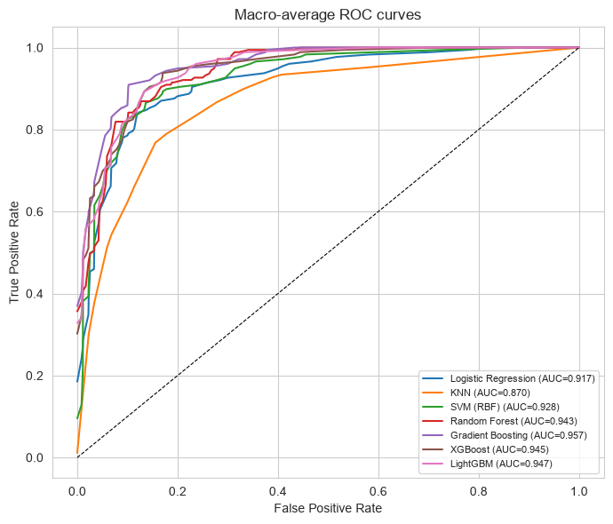
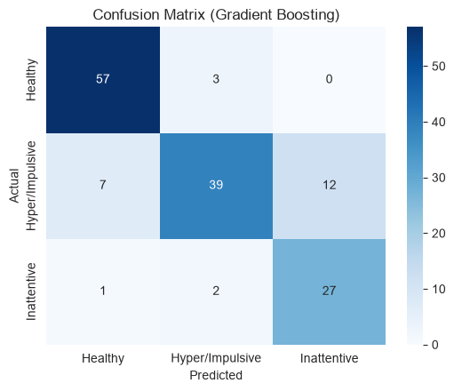
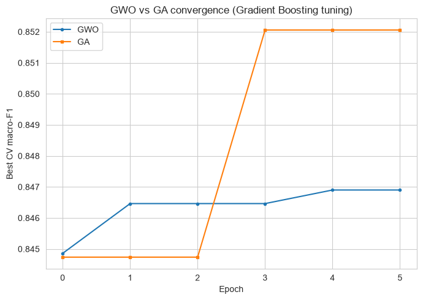
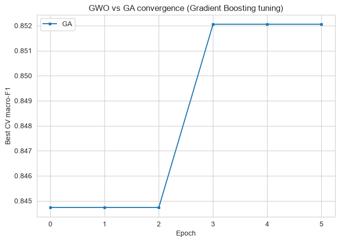
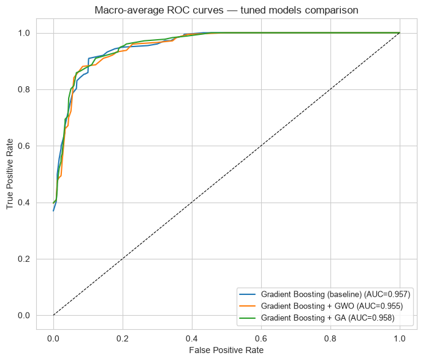
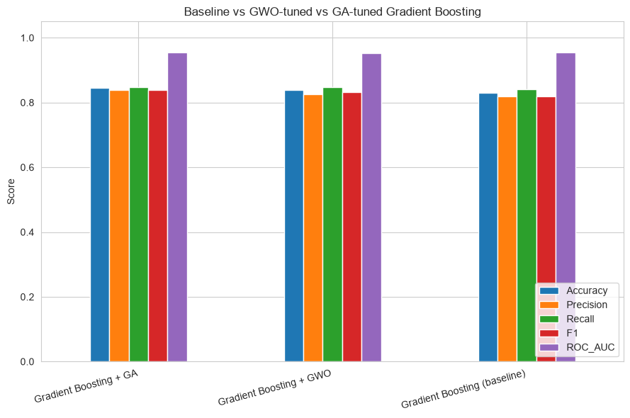
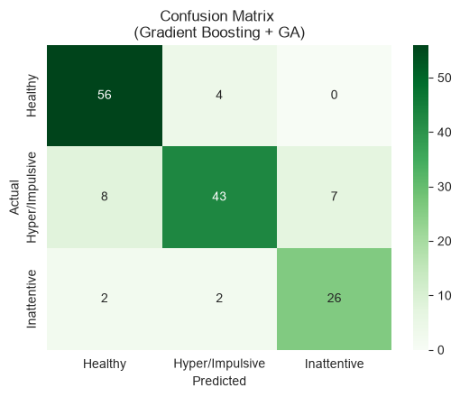

# ADHD Diagnosis Classifier

A machine learning pipeline that classifies subjects into **Healthy / Hyper-Impulsive / Inattentive**
based on demographic, clinical (ADHD Index, Inattentive, Hyper-Impulsive scores), and IQ features.
The final model is a **Gradient Boosting Classifier** tuned via **Genetic Algorithm (GA)**
hyperparameter search, deployed as an interactive **Streamlit app** with SHAP-based explanations.

---

## Table of Contents

- [Dataset & Features](#dataset--features)
- [Model Selection](#model-selection)
- [Hyperparameter Tuning: GA vs GWO](#hyperparameter-tuning-ga-vs-gwo)
- [Final Model Performance](#final-model-performance)
- [Results Summary](#results-summary)
- [Streamlit App](#streamlit-app)
- [Project Structure](#project-structure)
- [Setup](#setup)

---

## Dataset & Features

Features used for classification:

| Feature | Description |
|---|---|
| `Gender` | 0 = Female, 1 = Male |
| `Age` | Age in years |
| `Handedness` | 0 = Left, 1 = Right |
| `ADHD Index` | Clinical ADHD index score |
| `Inattentive` | Inattentive subscale score |
| `Hyper_Impulsive` | Hyperactive/Impulsive subscale score |
| `Verbal IQ` | Verbal IQ score |
| `Performance IQ` | Performance IQ score |
| `Full4 IQ` | Full-scale IQ score |
| `Med Status` | 1 = Not medicated, 2 = Medicated |

Target classes: **Healthy**, **Hyper/Impulsive**, **Inattentive**.

---

## Model Selection

Seven candidate models were evaluated using macro-averaged ROC-AUC:



**Gradient Boosting** came out on top (AUC = 0.957), clearly ahead of Logistic Regression, KNN,
SVM (RBF), Random Forest, and roughly on par with XGBoost / LightGBM. Its baseline confusion
matrix:



Gradient Boosting was carried forward as the base model for hyperparameter tuning.

---

## Hyperparameter Tuning: GA vs GWO

Two metaheuristic optimizers were used to tune the Gradient Boosting hyperparameters,
each optimizing macro-F1 via cross-validation:

- **GA** — Genetic Algorithm
- **GWO** — Grey Wolf Optimizer



GA converged to a higher best CV macro-F1 (~0.852) than GWO (~0.847), reaching it earlier
and holding it across epochs.

GA convergence in isolation:



**GA was selected as the final tuning strategy.**

---

## Final Model Performance

Comparing baseline Gradient Boosting against its GWO-tuned and GA-tuned variants:



| Model | Accuracy | Precision | Recall | F1 | ROC-AUC |
|---|---|---|---|---|---|
| Gradient Boosting + GA | **0.8446** | **0.8380** | **0.8471** | **0.8393** | **0.9551** |
| Gradient Boosting + GWO | 0.8378 | 0.8264 | 0.8467 | 0.8317 | 0.9517 |
| Gradient Boosting (baseline) | 0.8311 | 0.8185 | 0.8408 | 0.8198 | 0.9538 |

**Best tuned model: Gradient Boosting + GA**, improving accuracy, precision, recall, and F1
over the untuned baseline while maintaining the best ROC-AUC among the three variants.

Macro-average ROC, tuned models compared directly:



Final confusion matrix (Gradient Boosting + GA):



---

## Results Summary

- Gradient Boosting outperformed all other baseline classifiers (Logistic Regression, KNN,
  SVM, Random Forest, XGBoost, LightGBM) on macro-average ROC-AUC.
- GA-based hyperparameter tuning outperformed GWO-based tuning, reaching a higher
  cross-validated macro-F1.
- The final **Gradient Boosting + GA** model achieves **84.5% accuracy** and **0.955 ROC-AUC**
  on the held-out test set, correctly classifying most Healthy and Inattentive subjects, with
  the majority of remaining confusion between the Hyper/Impulsive and Inattentive classes.

---

## Streamlit App

An interactive app (`app.py`) lets users enter subject features and get a live prediction with
a SHAP-based explanation of the result.

**Features:**
- Sidebar inputs for all 10 model features (demographics, clinical scores, IQ scores)
- Predicted class + full class-probability breakdown
- SHAP explanation scoped to the predicted class:
  - Plain-language summary of which features pushed the prediction toward vs. away from
    the predicted class, plus the single biggest driver
  - SHAP waterfall plot for the individual prediction
  - SHAP feature-contribution bar chart
- Dark-mode UI throughout (including Streamlit's header/toolbar)

### Demo
[▶ Watch the app demo](figures/streamlit-app.webm)

**Run it:**
```bash
pip install -r requirements.txt
streamlit run app.py
```

> Requires `adhd_model_bundle.joblib` (model + scaler + winsorization bounds + feature list)
> in the same folder as `app.py`, produced by the training notebook's save-model step.

---

## Project Structure

```
.
├── app.py                      # Streamlit app (prediction + SHAP explanation)
├── requirements.txt            # App dependencies
├── models/
|   ├── adhd_model_bundle.joblib    # Trained model bundle (not included — generate from notebook)
├── figures/
│   ├── roc.png                 # Macro-avg ROC, all 7 baseline models
│   ├── GBConfusionmatrix.png   # Confusion matrix, Gradient Boosting baseline
│   ├── GAvsGWO.png             # GA vs GWO convergence comparison
│   ├── GA.png                  # GA convergence (isolated)
│   ├── tuned-comparison.png    # Baseline vs GWO-tuned vs GA-tuned metrics
│   ├── plot.png                # Macro-avg ROC, tuned models comparison
│   └── confusionMatrix.png     # Confusion matrix, final GA-tuned model
├── result.txt                  # Raw tuned-model comparison metrics
└── README.md
```

---

## Setup

1. Train the model and export the bundle from the notebook (`ADHD_MAIN.ipynb`):
   `adhd_model_bundle.joblib`
2. Place the bundle in the project root, alongside `app.py`.
3. Install dependencies:
   ```bash
   pip install -r requirements.txt
   ```
4. Launch the app:
   ```bash
   streamlit run app.py
   ```
